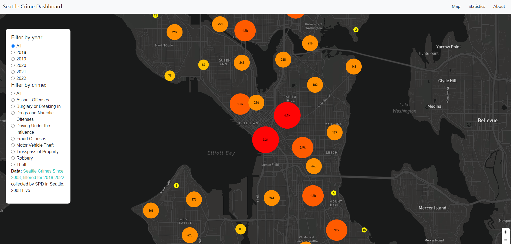
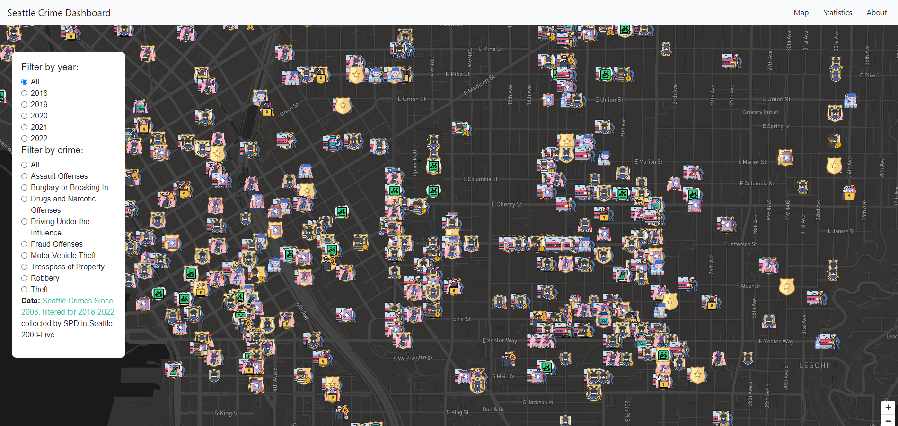

# Seattle's Crime Data Visualized on Mapbox

Link to hosted website: https://ayatab.github.io/crime-data-dashboard/

## Project Description

We created a smart dashboard displaying Seattle crime statistics. The data set we used includes longitude and latitude information of crimes that have occurred and the different types of crime, which we will be visualizing using different icons, each representing the type of crime at a location. At a first glance, the user will be able to see clusters of where crimes are the most prevalent in Seattle, which is also color gradiented and have different radii based on the number of crimes. Upon zooming in, the clusters will change to individual icons for crimes, and when clicking on an icon, there will be a pop-up displaying the timestamp of the crime and what kind of crime it was.

With the data on types of crimes and its timeline, we can separate the crimes per year on the map and we can show statistics on what kind of crimes were prevalent in each area. For reference, here are the images for each icon:

Icons for assault: 

Icons for burglary or breaking in: 

Icons for destruction of property: 

Icons for drugs or narcotic offenses: 

Icons for driving under the influence: 

Icons for fraud offenses: 

Icons for motor vehicle theft: 

Icons for trespass of property: 

Icons for robbery: 

Icons for theft: 

All other crimes that had a lower statistic of occurrences: 

## Project Goal, Significance and Broader Impacts

Our project can be used to help people who are deciding where they would like to live as well as to inform law enforcers or police which areas may need stricter patrols to decrease crime levels. Easily accessible maps that are visualized in this manner and kept up to date can help people in real time when looking to travel, making plans, and even for routing, especially if they are walking.

We can see that people may try to find crime data outside of Seattle, or crimes in real time. However, our data is only of finalized crime reports in Seattle, so it may not be representative of all crimes that occurred. We need to specify that our data is just local to Seattle for our mapping purposes, so crimes will only be shown for the city of Seattle. We have also filtered our data to take out crimes without a longitude or latitude number, so the crime number and locations are not completely accurate. Lastly, we do not have real time data, so all data shown will be for reference on recent and annual data analysis to see what areas are safe or not as safe via the map visualizations.

To prevent false interpretations, we could include a disclaimer or note on our website that explains what type of data was collected. 

## Map Functions

When zoomed out, you will be able to see clusters of areas where crimes are aggregated. This is color gradiented and the radius of the cluster will change for the amount of crime that is present in an area. 

When you zoom in, you will see custom icons for the crimes in the area and you will be able to filter out certain points in the data to display different crimes. We found that some of the crimes were logged in the same longitude and latitude in the dataset, so we decided the best workflow to be able to separate crimes in the area was to create filters to indivisually show crimes.

## Libraries and Web Services Used

Mapbox, Bootstrap, D3, Tableau embeds, Github Pages

## Major Data Sources

Our primary data source for crime statistics comes from the city of Seattle at: https://data.seattle.gov/Public-Safety/SPD-Crime-Data-2008-Present/tazs-3rd5. 

We will be potentially using the shapefiles of each neighborhood, listed in: https://catalog.data.gov/dataset/micro-community-policing-plans-1a52e/resource/cb04d751-54e8-40a8-bfc1-98ab29200672 or at:
https://data-seattlecitygis.opendata.arcgis.com/datasets/city-clerk-neighborhoods/explore?location=47.614536%2C-122.336950%2C12.87

## Team Members

Amber Lee, Anirit Bansal, Ayata Bernhardt, Jason Lim

## Acknowledgment

Many thanks to Professor Bo Zhao and our TA, Steven Bao, for giving us insights and resources to use via labs and lectures for Mapbox and Javascript to help complete the project.